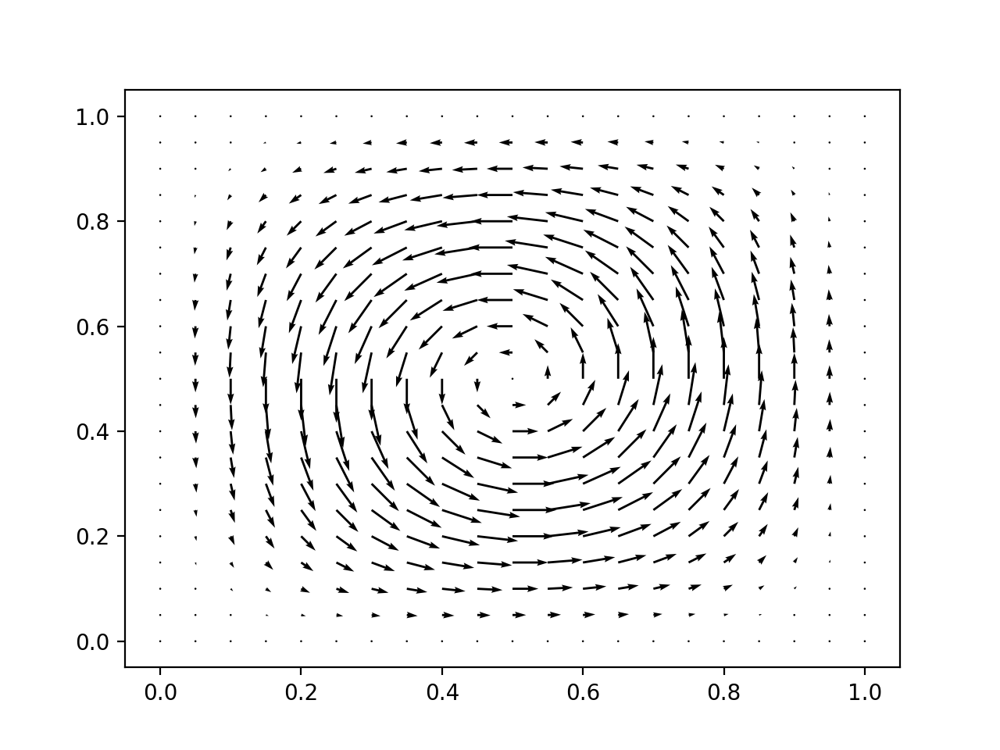

.. default-role:: math

.. _mixed:

==============
Mixed problems
==============

.. note::

   This section is the mastery exercise for this module. This exercise
   is explicitly intended to test whether you can bring together what
   has been learned in the rest of the module in order to go beyond
   what has been covered in lectures and labs.

   This exercise is not a part of the third year version of this module.

As an example of a mixed problem, let's take the Stokes problem presented in
:numref:`stokes` of the analysis part of the course. The weak form of the
Stokes problem presented in :numref:`Definition %s <weak_stokes>` is find
`(u,p)\in V\times Q` such that:

.. math::
    :label: stokes_ch9

    a(u,v) + b(v, p) & = \int_\Omega f\cdot v\,\mathrm{d}\, x,
      
    b(u,q) & = 0, \quad \forall (v,q) \in V\times Q,

where

.. math::
    :label:

    a(u,v) & = \mu\int_\Omega \epsilon(u):\epsilon(v)\,\mathrm{d}\, x,

    b(v,q) & = \int_\Omega q \nabla\cdot v\,\mathrm{d}\, x,

    V & =(\mathring{H}^1(\Omega))^d,

    Q & =\mathring{L}^2(\Omega),

and where `(\mathring{H}^1(\Omega))^d` is the subspace of `H^1(\Omega)^d` for
which all components vanish on the boundary, and `\mathring{L}^2(\Omega)` is
the subspace of `L^2(\Omega)` for which the integral of the function over the
domain vanishes. This last constraint was introduced to remove the null space
of constant pressure functions from the system. This constraint introduces a
little complexity into the implementation. So instead, we will redefine
`\mathring{L}^2(\Omega)` to be the subspace of `L^2(\Omega)` constrained to
take the value 0 at some arbitrary but specified point. For example, one might
choose to require the pressure at the origin to vanish. This is also an
effective way to remove the nullspace, but it is simpler to implement. We will
implement the two-dimensional case (`d=2`) and, for simplicity, we will assume `\mu=1`.

The colon (`:`) indicates an inner product so:

.. math::
    :label:

    \epsilon(u):\epsilon(v) = \sum_{\alpha\beta} \epsilon(u)_{\alpha\beta}\epsilon(v)_{\alpha\beta}

In choosing a finite element subspace of `V \times Q` we will similarly choose
a simpler to implement, yet still stable, space than was chosen in
:numref:`Analysis Section %s <stokes>`. The space we will use is the lowest order
Taylor-Hood space :cite:`Taylor1973`. This has:

.. math::
    :label:

    V^h & = P2(\Omega)^2

    Q^h & = P1(\Omega)

i.e. quadratic velocity and linear pressure on each cell. We note that 
`Q^h\in H^1(\Omega)` but since `H^1(\Omega) \subset L^2(\Omega)`, this is not
itself a problem. We will impose further constraints on the spaces in the
form of Dirichlet boundary conditions to ensure that the solutions found are in
fact in `V \times Q`.

In addition to the finite element functionality we have already implemented,
there are two further challenges we need to address. First, the implementation
of the vector-valued space `P2(\Omega)^2`m and second, the implementation of
functions and matrices defined over the mixed space `V^h \times Q^h`.

Vector-valued finite elements
-----------------------------

Consider the local representation of `P2(\Omega)^2` on one element. The scalar
`P2` element on one triangle has 6 nodes, one at each vertex and one at each
edge. If we write `\{\Phi_i\}_{i=0}^{5}` for the scalar basis, then a basis
`\{\mathbf{\Phi}_i\}_{i=0}^{11}` for the vector-valued space is given by:

.. math::
    :label: vector_basis

    \mathbf{\Phi}_i(X) = \Phi_{i\,//\,2}(X)\,\mathbf{e}_{i\,\%\,2}

where `//` is the integer division operator, `\%` is the modulus operator, and
`{\mathbf{e}_0, \mathbf{e}_1}` is the standard basis for `\mathbb{R}^2`. That is to say, we
interleave `x` and `y` component basis functions.

.. figure:: p2vec.*
    
    The local numbering of vector degrees of freedom.

We can practically implement vector function spaces by implementing a new class
:class:`fe_utils.finite_elements.VectorFiniteElement`. The constructor
(:meth:`~object.__init__`) of this new class should take a
:class:`~fe_utils.finite_elements.FiniteElement` and construct the
corresponding vector element. For current purposes we can assume that the
vector element will always have a vector dimension equal to the element
geometric and topological dimension (i.e. 2 if the element is defined on a
triangle). We'll refer to this dimension as `d`.

Implementing :class:`VectorFiniteElement`
.........................................

:class:`VectorFiniteElement` needs to implement as far as possible the same
interface as :class:`~fe_utils.finite_elements.FiniteElement`. Let's think
about how to do that.

:data:`cell`, :data:`degree`
    Same as for the input :class:`~fe_utils.finite_elements.FiniteElement`.
:data:`entity_nodes`
    There will be twice as many nodes, and the node ordering is such that each
    node is replaced by a `d`-tuple. For example the scalar triangle P1
    entity-node list is:

    .. code-block:: python3

        {
            0 : {0 : [0], 1 : [1], 2 : [2]},
            1 : {0 : [], 1 : [], 2 : []},
            2 : {0 : []}
        }
    
    The vector version is achieved by looping over the scalar version and
    returning a mapping with the pair `2n, 2(n+1)` in place of node `n`:

    .. code-block:: python3

        {
            0 : {0 : [0, 1], 1 : [2, 3], 2 : [4, 5]},
            1 : {0 : [], 1 : [], 2 : []},
            2 : {0 : []}
        }
:data:`nodes_per_entity`:
    Each entry will be `d` times that on the input
    :class:`~fe_utils.finite_elements.FiniteElement`.

Tabulation
..........

In order to tabulate the element, we can use :eq:`vector_basis`. We first
call the tabulate method from the input
:class:`~fe_utils.finite_elements.FiniteElement`, and we use this and
:eq:`vector_basis` to produce the array to return. Notice that the array
will both have a basis functions dimension which is `d` times longer than the
input element, and will also have an extra dimension to account for the
multiplication by `\mathbf{e}_{i\,\%\,d}`. This means that the tabulation array
with :data:`grad=False` will now be rank 3, and that with :data:`grad=True`
will be rank 4. Make sure you keep track of which rank is which!
The :class:`VectorFiniteElement` will need to keep a reference to the
input :class:`~fe_utils.finite_elements.FiniteElement` in order to facilitate
tabulation. 

Nodes
.....

Even though we didn't need the nodes of the :class:`VectorFiniteElement` to
construct its basis, we will need them to implement interpolation. In
:numref:`Definition %s <nodalbasis>` we learned that
the nodes of a finite element are related to the corresponding nodal basis by:

.. math::
    :label:

    \mathbf{\Phi}^*_i(\mathbf{\Phi}_j) = \delta_{ij}

From :eq:`vector_basis` and assuming, as we have throughout the course,
that the scalar finite element has point evaluation nodes given by:

.. math::
    :label:

    \Phi_i(v) = v(X_i),

it follows that:

.. math::
    :label: vectornodes

    \mathbf{\Phi}^*_i(v) & = \Phi^*_{i\,//\,d}(\mathbf{e}_{i\,\%\,d}\cdot v)

    & = \mathbf{e}_{i\,\%\,d}\cdot v(X_{i\,//\,d})

.. hint::

    To see that this is the correct nodal basis, choose
    :math:`v=\mathbf{\Phi}_j` in :eq:`vectornodes` and substitute
    :eq:`vector_basis` for :math:`\mathbf{\Phi}_j`.

This means that the correct :data:`VectorFiniteElement.nodes` attribute is
the list of nodal points from the input
:class:`~fe_utils.finite_elements.FiniteElement` but with each point repeated
`d` times. It will also be necessary to add another attribute, perhaps
:data:`node_weights` which is a rank 2 array whose `i`-th row is the correct
canonical basis vector to contract with the function value at the `i`-th node (`\mathbf{e}_{i\,\%\,d}`).

Vector-valued function spaces
-----------------------------

Assuming we correctly implement :class:`VectorFiniteElement`, 
:class:`~fe_utils.function_spaces.FunctionSpace` should work out of the box.
In particular, the global numbering algorithm only depends on having a correct
local numbering so this should work unaltered. 

Functions in vector-valued spaces
---------------------------------

The general form of a function in a vector-valued function space is:

.. math::
    :label:

    f = f_i \mathbf{\Phi}_i(X).

That is to say, the basis functions are vector valued and their coefficients
are still scalar. This means that if the :class:`VectorFiniteElement` had a
correct entity-node list then the core functionality of the existing
:class:`~fe_utils.function_spaces.Function` will automatically be correct. In
particular, the array of values will have the correct extent. However,
interpolation and plotting of vector valued fields will require some
adjustment.

Interpolating into vector-valued spaces
.......................................

Since the form of the nodes of a :class:`VectorFiniteElement` is different from
that of a scalar element, there will be some changes required in the
:meth:`~fe_utils.function_spaces.Function.interpolate()` method. Specifically:

.. code-block:: python3

    self.values[fs.cell_nodes[c, :]] = [fn(x) for x in node_coords]

This line will need to take into account the dot product with the
canonical basis from :eq:`vectornodes`, which you have implemented as
:data:`VectorFiniteElement.node_weights`. This change will need to be made
conditional on the class of finite element passed in, so that the code doesn't
break in the scalar element case.

Plotting functions in vector-valued spaces
..........................................

The coloured surface plots that we've used thus far for two-dimensional scalar
functions don't extend easily to vector quantities. Instead, a frequently used
visualisation technique is the quiver plot. This draws a set of
arrows representing the function value at a set of points. For our purposes,
the nodes of the function space in question are a good choice of evaluation
points. :numref:`qplot` provides the code you will need. Notice that at line 3
we interpolated the function `f(x)=x` into the function space in order to
obtain a list of the global coordinates of the node locations. At lines 6 and 7
we use what we know about the node ordering to recover vector values from the
list of basis function coefficients. 

.. _qplot:

.. code-block:: python3
    :caption: Code implementing quiver plots to visualise functions in vector
        function spaces. This code should be added to
        :meth:`~fe_utils.function_spaces.Function.plot()` immediately after the
        definition of :data:`fs`.
    :linenos:

    if isinstance(fs.element, VectorFiniteElement):
        coords = Function(fs)
        coords.interpolate(lambda x: x)
        fig = plt.figure()
        ax = fig.add_subplot()
        x = coords.values.reshape(-1, 2)
        v = self.values.reshape(-1, 2)
        plt.quiver(x[:, 0], x[:, 1], v[:, 0], v[:, 1])
        plt.show()
        return

Once this code has been inserted, then running the code in
:numref:`quiverplotcode` will result in a plot rather like
:numref:`quiverplot`.

.. _quiverplotcode:

.. code-block:: python3
    :caption: Creation of a vector function space, interpolation of a given
        function into it, and subsequent plot creation. 
    :linenos:

    from fe_utils import *
    from math import cos, sin, pi

    se = LagrangeElement(ReferenceTriangle, 2)
    ve = VectorFiniteElement(se)
    m = UnitSquareMesh(10,10)
    fs = FunctionSpace(m, ve)
    f = Function(fs)
    f.interpolate(lambda x: (2*pi*(1 - cos(2*pi*x[0]))*sin(2*pi*x[1]),
                             -2*pi*(1 - cos(2*pi*x[1]))*sin(2*pi*x[0])))
    f.plot()

.. _quiverplot:

    
    The quiver plot resulting from :numref:`quiverplotcode`.

Solving vector-valued systems
.............................

Solving a finite element problem in a vector-valued space is essentially
similar to the scalar problems you have already solved. It does, nonetheless,
provide a useful check on the correctness of your code before adding in the
additional complications of mixed systems. As a very simple example, consider
computing vector-valued field which is the gradient of a known function. For
some suitable finite element space `V\subset H^1(\Omega)^2` and
`f:\Omega\rightarrow \mathbb{R}`, find `u\in V` such that:

.. math::
    :label:

    \int_\Omega u\cdot v\,\mathrm{d}x = \int_\Omega \nabla f\cdot v\,\mathrm{d}x\quad \forall v\in V.

If `f` is chosen such that `\nabla f\in V` then this projection is exact up to
roundoff, and the following calculation should result in a good approximation
to zero:

.. math::
    :label:

    e = \int_\Omega (u -\nabla f)\cdot(u -\nabla f)\,\mathrm{d}x

.. note::

    The computations in this subsection are not required to complete the
    mastery exercise. They are, nonetheless, strongly recommended as a
    mechanism for checking your implementation thus far.

Mixed function spaces
---------------------

The Stokes equations are defined over the mixed function space `W = V \times Q`.
Here "mixed" simply means that there are two solution variables, and therefore
two solution spaces. Functions in `W` are pairs `(u, p)` where `u\in V` and
`p\in Q`. If `\{\phi_i\}_{i=0}^{m-1}` is a basis for `V` and
`\{\psi_j\}_{j=0}^{n-1}` then a basis for `W` is given by:

.. math::
    :label:

    \{\omega_i\}_{i=0}^{m+n-1}=\{(\phi_i, 0)\}_{i=0}^{m-1} \cup \{(0,
    \psi_{j-n})\}_{j=m}^{m+n-1}.
    
This in turn enables us to write `w\in W` in the form `w=w_i\omega_i` as we
would expect for a function in a finite element space. The Cartesian product
structure of the mixed space `W` means that the first `m` coefficients are
simply the coefficients of the `V` basis functions, and the latter `n`
coefficients correspond to the `Q` basis functions. This means that our full
mixed finite element system is simply a linear system of block matrices and
block vectors. If we disregard boundary conditions, including the pressure
constraint, this system has the following form:

.. math::
    :label:

    \begin{bmatrix}
        A & B^\mathrm{T} \\
        B & 0 
    \end{bmatrix}
    \begin{bmatrix}
        U \\
        P
    \end{bmatrix}
    =
    \begin{bmatrix}
        F \\ 
        0
    \end{bmatrix}

where:

.. math::
    :label: blocks

    A_{ij} = a(\phi_j, \phi_i),

    B_{ij} = b(\phi_j, \psi_i),

    F_i = \int_\Omega f\cdot v\, d\, x,

    U_i = u_i = w_i,

    P_i = p_i = w_{i+m}.

This means that the assembly of the mixed problem comes down to the assembly of
several finite operators of the form that we have already encountered. These
then need to be assembled into the full block matrix and right hand side
vector, before the system is solved and the resulting solution vector pulled
appart and interpreted as the coefficients of `u` and `p`. Observe in
:eq:`blocks` that the order of the indices `i` and `j` is reversed on the right
hand side of the equations. This reflects the differing conventions for matrix
indices and bilinear form arguments, and is a source of unending confusion in
this field.

Assembling block systems
........................

The procedure for assembling the individual blocks of the block matrix and the
block vectors is the one you are familiar with, but we will need to do
something new to assemble the block structures. What is required differs
slightly between the matrix and the vectors.

In the case of the vectors, then it is sufficient to know that a slice into a
:class:`numpy.ndarray` returns a view on the same memory as the full vector.
This is most easily understood through an example:

.. code-block:: ipython3

    In [1]: import numpy as np

    In [2]: a = np.zeros(10)

    In [3]: b = a[:5]

    In [4]: b[2] = 1

    In [5]: a
    Out[5]: array([0., 0., 1., 0., 0., 0., 0., 0., 0., 0.])

This means that one can first create a full vector of length `n+m` and then
slice it to create subvectors that can be used for assembly.

Conversely, :mod:`scipy.sparse` provides the :func:`~scipy.sparse.bmat`
function which will stitch together a larger sparse matrix from blocks. In
order to have the full indexing options you are likely to want for imposing the
boundary conditions, you will probably want to specify that the resulting
matrix is in :data:`"lil"` format.

Boundary conditions
...................

The imposition of the constraint in `(\mathring{H}^1(\Omega))^2` that solutions
vanish on the boundary is a Dirichlet condition of the type that you have
encountered before. Observe that the condition changes the test space, which
affects whole rows of the block system, so you will want to impose the boundary
condition *after* assembling the block matrix. You will also need to ensure
that the constraint is applied to both the `x` and `y` components of the space.

The imposition of the constraint in `\mathring{L}^2(\Omega)` that the solution
is zero at some prescribed point can be achieved by selecting an arbitrary
basis function and applying a zero Dirichlet condition for that degree of
freedom. In this regard we can observe that there is nothing about the
implementation of Dirichlet conditions that constrains them to lie on the
boundary. Rather, they should be understood as specifying a subspace on which
the solution is prescribed rather than solved for. In this particular case,
that subspace is one-dimensional.

Solving the matrix system
.........................

The block matrix system that you eventually produce will be larger than many of
those we have previously encountered, and will have non-zero entries further
from the diagonal. This can cause the matrix solver to become expensive in both
time and memory. Fortunately, :mod:`scipy.sparse.linalg` now incorporates an
interface to `SuperLU <https://portal.nersc.gov/project/sparse/superlu/>`__,
which is a high-performance direct sparse solver. The recommended solution
strategy is therefore:

1. Convert your block matrix to :class:`scipy.sparse.csc_matrix`, which is the
   format that SuperLU requires.
2. Factorise the matrix using :func:`scipy.sparse.linalg.splu`. 
3. Use the resulting :class:`~scipy.sparse.linalg.SuperLU` object to finally solve
   the system.

Computing the error
...................

We will wish to compute the convergence of our solution in the `L^2` norm. For
`w\in W`, this is given by:

.. math::
    :label:

    \|w\|_{L^2} = \sqrt{\int_\Omega w\cdot w\,\mathrm{dx}}

When we expand this in terms of the basis of `W`, it will be useful to note
that basis functions from the different component spaces are orthogonal. That
is to say:

.. math::
    :label:

    (\phi, 0) \cdot (0, \psi) = 0 \quad \forall \phi\in V,\, \psi \in Q.

The direct result of this is that if `w = (u, p)` then:

.. math::
    :label:

    \|w\|_{L^2}^2 = \|u\|_{L^2}^2 + \|p\|_{L^2}^2.

Manufacturing a solution to the Stokes equations
------------------------------------------------

As previously, we will wish to check our code using the method of manufactured
solutions. The Stokes equations represent a form of incompressible fluid
mechanics, so it is usually preferable to select a target solution for which
`\nabla\cdot u = 0`. The straightforward way to do this is to choose a scalar
field `\gamma: \Omega\rightarrow \mathbb{R}` to use as a streamfunction. We can
then define `u = \nabla^{\perp}\gamma` and rely on the vector calculus identity
`\nabla\cdot\nabla^{\perp} \gamma = 0` to guarantee that the velocity field is
divergence-free. We also need to ensure that `u` satisfies the boundary
conditions, which amounts to choosing `\gamma` such that its gradient vanishes
on the domain boundary. The following function is a suitable choice on a unit
square domain:

.. math::
    :label: stream

    \gamma(x,y) = \big(1-\cos(2\pi x)\big)\big(1-\cos(2\pi y)\big)

Implementing the Stokes problem
-------------------------------

.. proof:exercise::

    The goal of this exercise is to implement a solver for the Stokes
    equations, on a unit square. Implement
    :func:`~fe_utils.solvers.mastery.solve_mastery` so that it solves
    :eq:`stokes_ch9` using the forcing function derived from :eq:`stream`.

    Your full solution should:

    1. Implement :class:`VectorFiniteElement`. 
    2. Make the consequential changes to 
       :class:`~fe_utils.function_spaces.Function` to enable values 
       to be interpolated into vector-valued functions, and to create quiver plots.
    3. Assemble and solve the required mixed system.
    4. Compute the `L^2` error of the mixed solution from the analytic solution.
    
    A convergence test for your code is provided in
    ``test/test_13_mastery_convergence.py``. In order to be compatible with
    this code, your implementation of
    :func:`~fe_utils.solvers.mastery.solve_mastery` should return its results
    as a tuple of the form :data:`(u, p), error`. This is a slight change from
    the comment in the code which takes into account that the problem is mixed.
    The obvious consequential change will be needed at the end of
    :mod:`fe_utils.solvers.mastery`.
