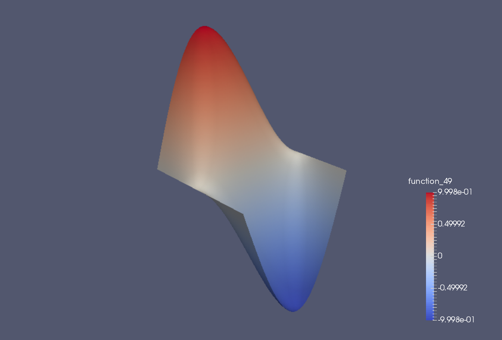
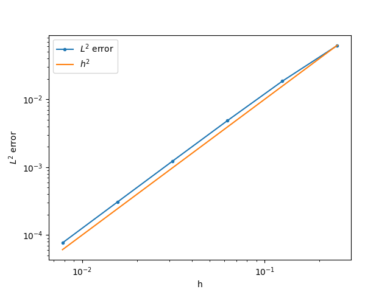

.. default-role:: math

Introduction
============

.. dropdown:: A video recording of the following material is available here.

    .. container:: vimeo

        .. raw:: html

            <iframe src="https://player.vimeo.com/video/490698097"
            frameborder="0" allow="autoplay; fullscreen"
            allowfullscreen></iframe>

    Imperial students can also `watch this video on Panopto <https://imperial.cloud.panopto.eu/Panopto/Pages/Viewer.aspx?id=6aca04a5-7fd9-4d9d-9178-ac2b0115718d>`_

In this section we provide an introduction that establishes some
initial ideas about how the finite element method works and what it is
about.

The finite element method is an approach to solving partial
differential equations (PDEs) on complicated domains. It has the
flexibility to build discretisations that can increase the order of
accuracy, and match the numerical discretisation to the physical
problem being modelled. It has an elegant mathematical formulation
that lends itself both to mathematical analysis and to flexible code
implementation. In this course we blend these two directions together.

Poisson's equation in the unit square
-------------------------------------

.. dropdown:: A video recording of the following material is available here.

    .. container:: vimeo

        .. raw:: html

            <iframe src="https://player.vimeo.com/video/490697959"
            frameborder="0" allow="autoplay; fullscreen"
            allowfullscreen></iframe>

    Imperial students can also `watch this video on Panopto <https://imperial.cloud.panopto.eu/Panopto/Pages/Viewer.aspx?id=c6be8b35-aa19-4e33-8d25-ac2b011caba3>`_
In this introduction we concentrate on the specific model problem of
Poisson's equation in the unit square.

.. proof:definition:: Poisson's equation in the unit square

   Let `\Omega=[0,1]\times[0,1]`. For a given function `f`, we seek `u` such
   that
   
   .. math::
       :label: eq:strong_Poisson

       -\left(\frac{\partial^2}{\partial x^2}+\frac{\partial^2}{\partial y^2}\right)u:=-\nabla^2 u = f, \quad
       u(0,y)=u(1,y)=0, \, \frac{\partial u}{\partial y}(x,0)=\frac{\partial u}{\partial y}(x,1)=0.

In this problem, the idea is that we are given a specific known
function `f` (for example, `f = sin(2\pi x)sin(2 \pi y)`), and we have
to find the corresponding unknown function `u` that satisfies the
equation (including the boundary conditions). Here we have combined a
mixture of Dirichlet boundary conditions specifying the value of the
function `u`, and Neumann boundary conditions specifying the value of
the normal derivative `\partial u/\partial n`. This is because these
two types of boundary conditions are treated differently in the finite
element method, and we would like to expose both treatments in the
same example. The treatment of boundary conditions is one of the
strengths of the finite element method.

Triangulations
--------------

.. dropdown:: A video recording of the following material is available here.
		  
    .. container:: vimeo

        .. raw:: html

            <iframe src="https://player.vimeo.com/video/490697890"
            frameborder="0" allow="autoplay; fullscreen"
            allowfullscreen></iframe>

    Imperial students can also `watch this video on Panopto <https://imperial.cloud.panopto.eu/Panopto/Pages/Viewer.aspx?id=db13f3fa-b3cb-41d1-b888-ac2b011f11e3>`_

The description of our finite element method starts by considering
a triangulation.

.. proof:definition:: Triangulation

   Let `\Omega` be a polygonal subdomain of `\mathbb{R}^2`. A triangulation
   `\mathcal{T}` of `\Omega` is a set of triangles `\{K_i\}_{i=1}^N`, such
   that:

   #. `\mathrm{int}\, K_i \cap K_j = \emptyset, \quad i\neq j`, where `\mathrm{int }` denotes the interior of a set (no overlaps).
   #. `\cup K_i = \bar{\Omega}`, the closure of `\Omega` (triangulation covers
      `\Omega`).
   #. No vertex of the interior of any triangle is located in the interior of any other triangle in `\mathcal{T}` (triangle vertices only meet other triangle vertices).

Our first finite element space
------------------------------

.. dropdown:: A video recording of the following material is available here.
		  
    .. container:: vimeo

        .. raw:: html

            <iframe src="https://player.vimeo.com/video/490697877"
            frameborder="0" allow="autoplay; fullscreen"
            allowfullscreen></iframe>

    Imperial students can also `watch this video on Panopto <https://imperial.cloud.panopto.eu/Panopto/Pages/Viewer.aspx?id=2a222f38-92ce-478e-946c-ac2b0120bf58>`_

The idea is that we will approximate functions which are polynomial
(at some chosen degree) when restricted to each triangle, with some
chosen continuity conditions between triangles. We shall call the
space of possible functions under these choices a finite element
space.  In this introduction, we will just consider the following
space.

.. proof:definition:: The \(P1\) finite element space

  Let `\mathcal{T}` be a triangulation of `\Omega`. Then the P1 finite
  element space is a space `V_h` containing all functions `v` such that

  #. `v\in C^0(\Omega)`,
  #. `v|_{K_i}` is a linear function for each `K_i\in \mathcal{T}`.

  We also define the following subspace,

  .. math::
    :label: eq:bcs_subspace

    \mathring{V}_h = \left\{
      v\in V_h: v(0,y)=v(1,y)=0
      \right\}.

This is the subspace of the P1 finite element space `V_h` of functions
that satisfy the Dirichlet boundary conditions. We will search only
amongst `\mathring{V}_h` for our approximate solution to the Poisson
equation. This is referred to as strong boundary conditions. Note that
we do not consider any subspaces related to the Neumann
conditions. These will emerge later.

Integral formulations and `L_2`
-------------------------------

.. dropdown:: A video recording of the following material is available here.
		  
    .. container:: vimeo

        .. raw:: html

            <iframe src="https://player.vimeo.com/video/490697738"
            frameborder="0" allow="autoplay; fullscreen"
            allowfullscreen></iframe>

    Imperial students can also `watch this video on Panopto <https://imperial.cloud.panopto.eu/Panopto/Pages/Viewer.aspx?id=10377186-f51a-49e2-8b0b-ac2b012265df>`_

The finite element method is based upon integral formulations of
partial differential equations. Rather than checking if two functions
are equal by checking their value at every point, we will just check
that they are equal in an integral sense. We do  this by introducing
the `L^2` norm, which is a way of measuring the "magnitude" of a function.

.. proof:definition::

   For a real-valued function `f` on a domain `\Omega`, with Lebesgue integral

   .. math::

      \int_\Omega f(x)\,dx,

   we define the `L^2` norm of `f`,

   .. math::

      \|f\|_{L^2}(\Omega) = \left(\int_\Omega |f(x)|^2\,dx \right)^{1/2}.

This motivates us to say that two functions are equal if the `L^2`
norm of their difference is zero. It only makes sense to do that if
the functions individually have finite `L^2` norm, which then also
motivates the `L^2` function space.
  
.. proof:definition::

   We define `L^2(\Omega)` as the set of functions

   .. math::
   
      L^2(\Omega) = \left\{ f:\|f\|_{L^2}(\Omega)<\infty\right\},

  and identify two functions `f` and `g` if `\|f-g\|_{L^2(\Omega)}=0`,
  in which case we write `f\equiv g` in `L^2`.

.. proof:example::
  
   Consider the two functions `f` and `g` defined on
   `\Omega=[0,1]\times[0,1]` with

   .. math::
   
      f(x,y) = \left\{\begin{array}{cc}
      1 & x\geq 0.5, \\
      0 & x < 0.5, \\
      \end{array}\right. \,
      g(x,y) = \left\{\begin{array}{cc}
      1 & x> 0.5, \\
      0 & x \leq 0.5. \\
      \end{array}\right.
  
   Since `f` and `g` only differ on the line `x=0.5` which has zero
   area, then `\|f-g\|_{L^2(\Omega)}=0`, and so `f\equiv g` in `L^2`.

Finite element derivative
-------------------------

.. dropdown:: A video recording of the following material is available here.
		  
    .. container:: vimeo

        .. raw:: html

            <iframe src="https://player.vimeo.com/video/490697597"
            frameborder="0" allow="autoplay; fullscreen"
            allowfullscreen></iframe>

    Imperial students can also `watch this video on Panopto <https://imperial.cloud.panopto.eu/Panopto/Pages/Viewer.aspx?id=897d8372-11bd-4904-a1db-ac2c00fc7835>`_

Functions in `V_h` do not have derivatives everywhere. This means that
we have to work with a more general definition (and later we shall
learn when it does and does not work).

.. proof:definition:: Finite element partial derivative

   The finite element partial derivative
   `\frac{\partial^{FE}}{\partial x_i}u` of `u` is defined in
   `L^2(\Omega)` such that restricted to `K_i`, we have

   .. math::
   
      \frac{\partial^{FE}u}{\partial x_i}|_{K_i}= \frac{\partial u}{\partial x_i}.

Here we see why we needed to introduce `L^2`: we have a definition
that does not have a unique value on the edge between two adjacent
triangles. This is verified in the following exercises.

.. proof:exercise::

   Let `V_h` be a P1 finite element space for a triangulation
   `\mathcal{T}` of `\Omega`. For all `u\in V_h`, show that the
   definition above uniquely defines `\frac{\partial^{FE}u}{\partial
   x_i}` in `L^2(\Omega)`.

.. proof:exercise::

   Let `u\in C^1(\Omega)` (the space of functions with finite-valued
   partial derivatives at every point in `\Omega`). Show that the
   finite element partial derivative and the usual derivative are
   equal in `L^2(\Omega)`.
  
In view of this second exercise, in this section we will consider all
derivatives to be finite element derivatives. In later sections we
shall consider an even more general definition of the derivative which
contains both of these definitions.

Towards the finite element discretisation
-----------------------------------------

.. dropdown:: A video recording of the following material is available here.
		  
    .. container:: vimeo

        .. raw:: html

            <iframe src="https://player.vimeo.com/video/490697493"
            frameborder="0" allow="autoplay; fullscreen"
            allowfullscreen></iframe>

    Imperial students can also `watch this video on Panopto <https://imperial.cloud.panopto.eu/Panopto/Pages/Viewer.aspx?id=7740df4e-bc02-4997-8c75-ac2c00fe54eb>`_

We will now use the finite element derivative to develop the finite
element discretisation. We assume that we have a solution `u` to
Equation :eq:`eq:strong_Poisson` that is smooth (i.e. `u\in C^1`). (Later,
we will consider more general types of solutions to this equation, but this
assumption just motivates things for the time being.)

We take `v\in \mathring{V}_h`, multiply by Equation :eq:`eq:strong_Poisson`, and integrate over the domain. Integration by parts in each triangle then gives

.. math::

   \sum_{i}\left(\int_{K_i} \nabla
   v\cdot \nabla u \, d x
   - \int_{\partial K_i} vn\cdot \nabla u \, d S\right)  =
   \int_\Omega vf \, d x,

where `n` is the unit outward pointing normal to `K_i`.
  
Next, we consider each interior edge `f` in the triangulation, formed
as the intersection between two neighbouring triangles `K_i\cap
K_j`. If `i>j`, then we label the `K_i` side of `f` with a `+`, and
the `K_j` side with a `-`. Then, denoting `\Gamma` as the union of all
such interior edges, we can rewrite our equation as

.. math::

   \int_\Omega \nabla v \cdot \nabla u \, d x - \int_\Gamma vn^+\cdot\nabla u
   + vn^-\cdot\nabla u \, d S
   - \int_{\partial\Omega} vn\cdot \nabla u \, d S 
    = \int_\Omega vf \, d x,

where `n^{\pm}` is the unit normal to `f` pointing from the `\pm` side
into the `\mp` side. Since `n^-=-n^+`, the interior edge integrals
vanish.
  
Further, on the boundary, either `v` vanishes (at `x=0` and `x=1`) or
`n\cdot\nabla u` vanishes (at `y=0` and `y=1`), and we obtain

.. math::
   
   \int_\Omega \nabla v \cdot \nabla u \, d x 
   = \int_\Omega vf \, d x. 

The finite element approximation is then defined by requiring that
this equation holds for all `v\in \mathring{V}_h` and when we restrict
`u\in \mathring{V}_h`.

.. dropdown:: A video recording of the following material is available here.
		  
    .. container:: vimeo

        .. raw:: html

            <iframe src="https://player.vimeo.com/video/490693961"
            frameborder="0" allow="autoplay; fullscreen"
            allowfullscreen></iframe>

    Imperial students can also `watch this video on Panopto <https://imperial.cloud.panopto.eu/Panopto/Pages/Viewer.aspx?id=099aeda2-0a23-4c88-ad0b-ac2c01051715>`_

.. _def-discrete-poisson:

.. proof:definition::
  
   The finite element approximation `u_h \in \mathring{V}_h` to the
   solution `u_h` of Poisson's equation is defined by
   
   .. math::
      :label: eq:fe_poisson
	    
      \int_\Omega \nabla v \cdot \nabla u_h \, d x =
      \int_\Omega vf \, d x, \quad \forall v\in \mathring{V}_h.

..
   End of week 1 material

.. dropdown:: A video recording of the following material is available here.
		  
    .. container:: vimeo

        .. raw:: html

            <iframe src="https://player.vimeo.com/video/490693998"
            frameborder="0" allow="autoplay; fullscreen"
            allowfullscreen></iframe>

    Imperial students can also `watch this video on Panopto <https://imperial.cloud.panopto.eu/Panopto/Pages/Viewer.aspx?id=f4cb8c0c-4664-4a21-8043-ac2c010738da>`_
      
We now present some numerical results for the case `f = 2\pi^2\sin(\pi
x)\sin(\pi y)`.

.. _figplots:

.. figure:: _static/level2.png
   :width: 60%

   Numerical solution on a `4\times 4` mesh.

.. figure:: _static/level4.png
   :width: 60%

   Numerical solution on a `16\times 16` mesh.

   Numerical solution on a `128\times 128` mesh.

   Plot showing error versus mesh resolution. We observe
   the error decreases proportionally to `h^2`, where `h` is
   the maximum triangle edge size in the triangulation.

We see that for this example, the error is decreasing as we increase
the number of triangles, for the meshes considered.

.. dropdown:: A video recording of the following material is available here.
		  
    .. container:: vimeo

        .. raw:: html

            <iframe src="https://player.vimeo.com/video/490693824"
            frameborder="0" allow="autoplay; fullscreen"
            allowfullscreen></iframe>

    Imperial students can also `watch this video on Panopto <https://imperial.cloud.panopto.eu/Panopto/Pages/Viewer.aspx?id=8319e621-155a-43a1-b181-ac8d00aed113>`_

In general, our formulation raises a number of questions.

#. Is `u_h` unique?
#. What is the size of the error `u-u_h`?
#. Does this error go to zero as the mesh is refined?
#. For what types of functions `f` can these questions be answered?
#. What other kinds of finite element spaces are there?
#. How do we extend this approach to other PDEs?
#. How can we calculate `u_h` using a computer?

We shall aim to address these questions, at least partially, through
the rest of this course. For now, we concentrate on the final
question, in general terms.

In this course we shall mostly concentrate on finite element methods
for elliptic PDEs, of which Poisson's equation is an example, using
continuous finite element spaces, of which `P1` is an example. The
design, analysis and implementation of finite methods for PDEs is a
huge field of current research, and includes parabolic and elliptic
PDEs and other PDEs from elasticity, fluid dynamics, electromagnetism,
mathematical biology, mathematical finance, astrophysics and
cosmology, etc. This course is intended as a starting point to
introduce the general concepts that can be applied in all of these
areas.

.. proof:exercise::

   Derive a finite element approximation for the following problem.

   Find `u` such that

      .. math::

	 -\nabla\cdot \left((2+\sin(2\pi x))\nabla u\right) =
	 \exp(\cos(2\pi x)),

   with boundary conditions `u=0` on the entire boundary.

.. proof:exercise::

   Derive a finite element approximation for the following problem.

   Find `u` such that

      .. math::

	 -\nabla^2 u = \exp(xy),

   in the `1\times 1` square region as above, with boundary conditions
   `u=x(1-x)` on the entire boundary.

.. proof:exercise::

   Derive a finite element approximation for the following problem.

   Find `u` such that

      .. math::

	 -\nabla^2 u = \frac{1}{1 + x^2 + y^2},

   in the `1\times 1` square region, with boundary conditions
   `u-\frac{\partial u}{\partial n}=x(1-x)` on the entire boundary.
   
Practical implementation
------------------------

.. dropdown:: A video recording of the following material is available here.
		  
    .. container:: vimeo

        .. raw:: html

            <iframe src="https://player.vimeo.com/video/490693738"
            frameborder="0" allow="autoplay; fullscreen"
            allowfullscreen></iframe>

    Imperial students can also `watch this video on Panopto <https://imperial.cloud.panopto.eu/Panopto/Pages/Viewer.aspx?id=11e55d12-a0fc-42ed-b609-ac8d00af7068>`_

The finite element approximation above is only useful if we can
actually compute it. To do this, we need to construct an efficient
basis for `P1`, which we call the nodal basis.

.. proof:definition:: P1 nodal basis

   Let `\{z_i\}_{i=1}^{M}` indicate the vertices in the triangulation
   `\mathcal{T}`. For each vertex `z_i`, we define a basis function
   `\phi_i\in V_h` by

   .. math::
      \phi_i(z_j) = \delta_{ij} :=
      \left\{
      \begin{array}{cc}
      1 & i=j, \\
      0 & i\ne j.
      \end{array}
      \right.

   We can define a similar basis for `\mathring{V}_h` by removing
   the basis functions `\phi_i` corresponding to vertices `z_i` on
   the Dirichlet boundaries `x=0` and `x=1`; the dimension of the
   resulting basis is `\bar{M}`.

If we expand `u_h` and `v` in the basis for `\mathring{V}_h`,

 .. math::

    u_h(x) = \sum_{i=1}^{\bar{M}}u_i\phi_i(x), \quad v(x) = \sum_{i=1}^{\bar{M}}v_i\phi_i(x),

into Equation :eq:`eq:fe_poisson`, then we obtain

.. math::
   \sum_{i=1}^{\bar{M}}v_i\left(\sum_{j=1}^{\bar{M}}\int_\Omega \nabla \phi_i\cdot \nabla \phi_j
   \,dx v_j - \int_\Omega \phi_if\,dx\right) = 0.

Since this equation must hold for all `v\in \mathring{V}_h`, then
it must hold for all basis coefficients `v_i`, and we obtain
the matrix-vector system

.. math::
   
   K\mathrm{u} = \mathrm{f},

where

.. math::

   K_{ij} = \int_\Omega \nabla\phi_i\cdot\nabla\phi_j\, d x,
   
   \mathrm{u}  = \left(u_1,u_2,\ldots,u_{\bar{M}}\right)^T,
   
   \mathrm{f}  = \left(f_1,f_2,\ldots,f_{\bar{M}}\right)^T, \quad f_i = \int_\Omega \phi_i f\, d x.

Once we have solved for `\mathrm{u}`, we can use these basis
coefficients to reconstruct the solution `u_h`. The system is square,
but we do not currently know that `K` is invertible. This is
equivalent to the finite element approximation having a unique
solution `u_h`, which we shall establish in later sections. This
motivates why we care that `u_h` exists and is unique.

.. dropdown:: A video recording of the following material is available here.
		  
    .. container:: vimeo

        .. raw:: html

            <iframe src="https://player.vimeo.com/video/490693615"
            frameborder="0" allow="autoplay; fullscreen"
            allowfullscreen></iframe>

    Imperial students can also `watch this video on Panopto <https://imperial.cloud.panopto.eu/Panopto/Pages/Viewer.aspx?id=9be9b911-c291-4c90-b3ac-ac8d00c0e814>`_

Putting solvability aside for the moment, the goal of the
implementation sections of this course is to explain how to
efficiently form `K` and `\mathrm{f}`, and solve this system.  For now
we note a few following aspects that suggest that this might be
possible. First, the matrix `K` and vector `\mathrm{f}` can be written
as sums over elements,

.. math::
   K_{ij} = \sum_{K\in\mathcal{T}}\int_K \nabla \phi_i\cdot\nabla \phi_j \, d x,
   
   \mathrm{where}\,f_i = \sum_{K\in\mathcal{T}}\int_K \phi_i f \, d x.

For each entry in the sum for `K_{ij}`, the integrand is composed
entirely of polynomials (actually constants in this particular case,
but we shall shortly consider finite element spaces using polynomials
of higher degree). This motivates our starting point in exposing the
computer implementation, namely the integration of polynomials over
triangles using quadrature rules. This will also motivate an efficient
way to construct derivatives of polynomials evaluated at quadrature
points. Further, we shall shortly develop an interpolation operator
`\mathcal{I}` such that `\mathcal{I}_f\in V_h`.  If we replace `f` by
`\mathcal{I}_f` in the approximations above, then the evaluation of `f_i` can also be performed via quadrature rules.

Even further, the matrix `K` is very sparse, since in most triangles,
both `\phi_i` and `\phi_j` are zero. Any efficient implementation must
make use of this and avoid computing integrals that return zero.
This motivates the concept of global assembly, the process of
looping over elements, computing only the contributions to `K` that
are non-zero from that element. Finally, the sparsity of `K`
means that the system should be solved using numerical linear algebra
algorithms that can exploit this sparsity.

Having set out the main challenges of the computational
implementation, we now move on to define and discuss a broader
range of possible finite element spaces.

