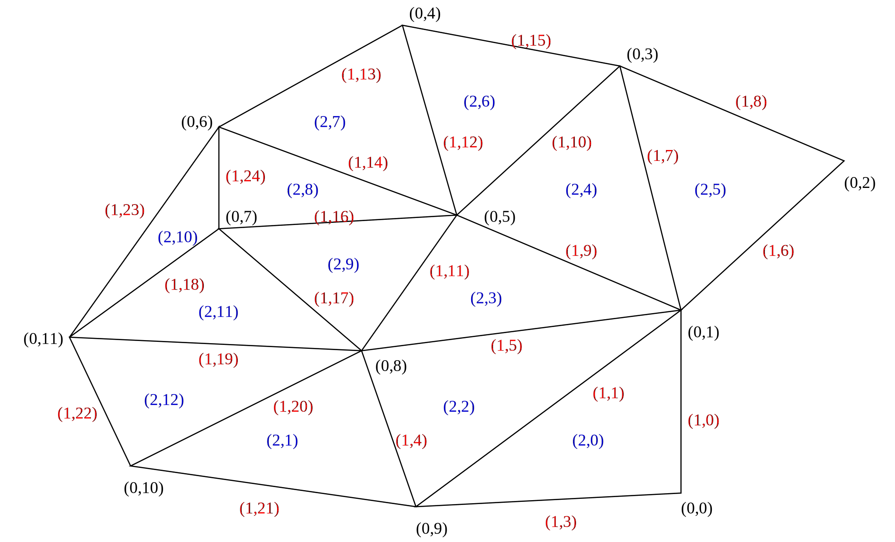

.. default-role:: math

Meshes
======

When employing the finite element method, we represent the domain on
which we wish to solve our PDE as a mesh. In order to work with
meshes, we need to have a somewhat more formal mathematical notion of
a mesh. The mesh concepts we will employ here are loosely based on
those in :cite:`Logg2009`, and are typical of mesh representations for the
finite element method.

Mesh entities
-------------

A mesh is composed of *topological entities*, such as vertices, edges,
polygons and polyhedra.

.. definition:: 

   The *(topological) dimension* of a mesh is the largest
   dimension among all of the topological entities in a mesh.

In this course we will not consider meshes of manifolds immersed in
higher dimensional spaces (for example the surface of a sphere
immersed in `\mathbb{R}^3`) so the topological dimension of the
mesh will always match the geometric dimension of space in which we
are working, so we will simply refer to the *dimension* of the mesh.

.. definition::

   A topological entity of *codimension* `n` is a topological
   entity of dimension `d-n` where `d` is the dimension of the
   mesh.

Armed with these definitions we are able to define names for
topological entities of various dimension and codimension:

=========== ========= ===========
entity name dimension codimension
=========== ========= ===========
vertex      0
edge        1
face        2
facet                 1
cell                  0
=========== ========= ===========

The cells of a mesh can be polygons or polyhedra of any shape, however
in this course we will restrict ourselves to meshes whose cells are
intervals or triangles. The only other two-dimensional cells
frequently employed are quadrilaterals.

The topological entities of each dimension will be given unique
numbers in order that degrees of freedom can later be associated with
them. We will identify topological entities by an index pair `(d, i)`
where `i` is the index of the entity within the set of `d`-dimensional
entities. For example, entity `(0, 10)` is vertex number 10, and
entity `(1, 10)` is edge 10. :numref:`figmesh` shows an example
mesh with the topological entities labelled.

.. _figmesh:

   A triangular mesh showing labelled topological entities: vertices
   (black), edges (red), and cells (blue).

Reference cell entities
-----------------------

The reference cells similarly have locally numbered topological
entities, these are shown in :numref:`figreferenceentities`. The
numbering is a matter of convention: that adopted here is that edges
share the number of the opposite vertex. The orientation of the edges
is also shown, this is always from the lower numbered vertex to the
higher numbered one.

.. _figreferenceentities:

.. figure:: entities.svg
   :width: 50%

   Local numbering and orientation of the reference entities.

Adjacency
---------

In order to implement the finite element method, we need to integrate
functions over cells, which means knowing which basis functions are
nonzero in a given cell. For the function spaces used in the finite
element method, these basis functions will be the ones whose nodes lie
on the topological entities adjacent to the cell. That is, the
vertices, edges and (in 3D) the faces making up the cell, as well as
the cell itself. One of the roles of the mesh is therefore to provide
a lookup facility for the lower-dimensional mesh entities adjacent to
a given cell.

.. definition::

   Given a mesh `M`, then for each `\dim(M) \geq d_1 > d_2 \geq 0`
   the *adjacency* function `\operatorname{Adj}_{d_1,d_2}:\,
   \mathbb{N}\rightarrow \mathbb{N}^k` is the function such that:

   .. math::

      \operatorname{Adj}_{d_1,d_2}(i) = (i_0, \ldots i_k)

   where `(d_1, i)` is a topological entity and `(d_2, i_0), \ldots,
   (d_2, i_k)` are the adjacent `d_2`-dimensional topological entities
   numbered in the corresponding reference cell order. If every cell
   in the mesh has the same topology then `k` will be fixed for each
   `(d_1, d_2)` pair. The correspondence between the orientation of
   the entity `(d_1, i)` and the reference cell of dimension `d_1` is
   established by specifying that the vertices are numbered in
   ascending order [#simplexnumbering]_. That is, for any entity `(d_1, i)`:
   
   .. math::

    (i_0, \ldots i_k) = \operatorname{Adj}_{d_1,0}(i) \quad \Longrightarrow \quad i_0 < \ldots <i_k

   
.. example::

   In the mesh shown in :numref:`figmesh` we have:
   
   .. math::

      \operatorname{Adj}_{2,0}(3) = (1,5,8).

   In other words, vertices 1, 5 and 8 are adjacent to cell 3. Simularly:

   .. math::

      \operatorname{Adj}_{2,1}(3) = (11,5,9).
   
   Edges 11, 5, and 9 are local edges 0, 1, and 2 of cell 3.

Mesh geometry
-------------

The features of meshes we have so far considered are purely
topological: they deal with the adjacency relationships between
topological entities, but do not describe the locations of those
entities in space.  

.. rubric:: Footnotes

.. [#simplexnumbering] The numbering convention adopted here is very
                       convenient, but only works for meshes composed
                       of simplices (vertices, intervals, triangles
                       and tetrahedra). A more complex convention
                       would be required to support quadrilateral
                       meshes.
